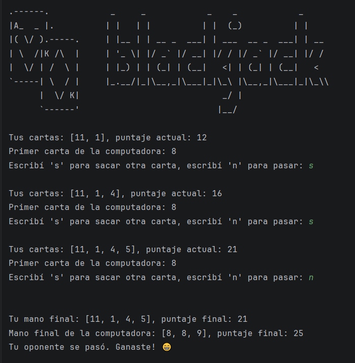
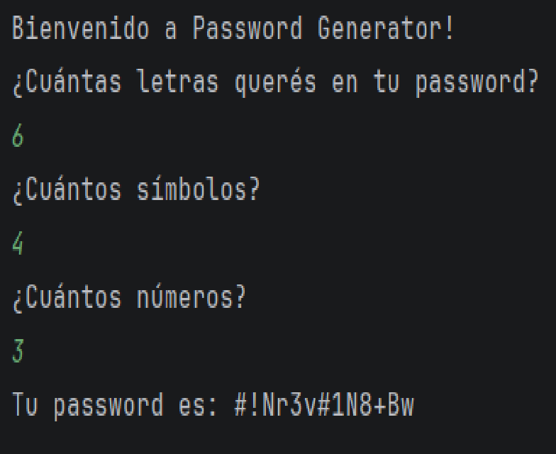

# 100_days_of_python
Repositorio con ejercicios y proyectos desarrollados durante el curso 100 Days of Code: The Complete Python Pro Bootcamp. Incluye práctica de fundamentos de Python, automatización, manipulación de datos, web scraping, desarrollo web y resolución de problemas mediante proyectos reales.

---

Repository with exercises and projects developed during the 100 Days of Code: The Complete Python Pro Bootcamp course. Includes practice in Python fundamentals, automation, data manipulation, web scraping, web development, and problem-solving through real-world projects.

---

/hangman.png)

